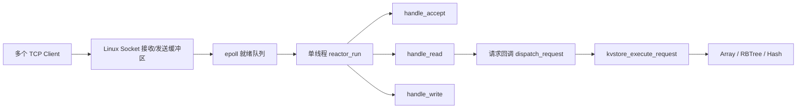

# v0.2.0 非阻塞 epoll Reactor 设计与工作流

## 1. 本阶段解决的问题

v0.1.0 的 epoll 代码只是网络样例：Socket 仍可能阻塞、连接通过 fd 下标放入超大
静态数组、一次 `send` 被假定为可以发送完整响应，错误和关闭路径也没有统一管理。

v0.2.0 将默认网络路径改造成：

```text
单线程 + 非阻塞 Socket + Level-Triggered epoll + 每连接独立缓冲区
```

Reactor 负责“等待事件、识别事件来源、把事件分发给对应处理函数”。KV 命令仍由
服务层执行，网络层不直接依赖 Array、RBTree、Hash 或某条具体命令。

本阶段还没有定义可靠的流式协议帧。一次读批次临时视为一条空格分隔文本命令；
RESP 增量解析、粘包、半包和 Pipeline 属于 v0.3.0。

## 2. 单线程 Reactor 模型

整个服务端只有一个事件循环线程。它不为每个连接创建线程，也没有工作线程池：



线程只在 `epoll_wait` 中等待。当内核报告 fd 已经具备非阻塞操作条件时，事件循环
才调用 `accept/recv/send`。一个事件处理完成后，线程继续处理同一批其他就绪事件。

这种模型的特点是：

- 连接不对应线程，连接数量不再直接决定线程数量和栈内存消耗。
- 网络事件和 KV 命令都在同一线程串行执行，当前引擎不需要为并发访问加锁。
- 任何耗时命令都会阻塞整个事件循环，因此本阶段的回调必须短小，不能执行阻塞
  I/O、长时间计算或等待其他线程。

## 3. 为什么所有 Socket 必须非阻塞

如果监听 Socket 或客户端 Socket 是阻塞的，一次没有立即完成的 `accept/recv/send`
就可能挂住唯一的 Reactor 线程，其他已经就绪的连接也无法被处理。

当前实现遵守以下规则：

- 监听 Socket 使用 `SOCK_NONBLOCK | SOCK_CLOEXEC` 创建。
- 客户端由 `accept4(..., SOCK_NONBLOCK | SOCK_CLOEXEC)` 接收，并再次检查非阻塞标志。
- `accept` 和 `recv` 循环执行，直到返回 `EAGAIN/EWOULDBLOCK`，表示本轮数据已取完。
- `send` 尽量发送全部待发送数据；如果返回 `EAGAIN`，保存已发送位置，等待下一次
  `EPOLLOUT`，不会原地等待 Socket 重新可写。
- `EINTR` 表示系统调用被信号打断，可以重试；其他错误进入统一关闭路径。

非阻塞并不表示系统调用永远成功，而是表示“现在不能完成时立即返回控制权”。
Reactor 随后依靠 epoll 通知何时再次尝试。

## 4. Level-Triggered epoll 的含义

v0.2.0 使用默认的 Level-Triggered（LT）模式，没有设置 `EPOLLET`。

只要 fd 的就绪条件仍成立，LT epoll 就会继续报告该事件。例如接收缓冲区仍有数据，
下一次 `epoll_wait` 仍会返回 `EPOLLIN`。这比 ET 更容易保证正确性；即便如此，当前
实现仍会把 `accept` 和 `recv` 主动处理到 `EAGAIN`，减少重复唤醒。

Socket 通常一直可写，因此不能永久注册 `EPOLLOUT`，否则事件循环会持续被唤醒并
形成忙轮询。当前实现只在输出缓冲区存在待发送数据时监听 `EPOLLOUT`，发送完成后
立即切回 `EPOLLIN | EPOLLRDHUP`。

## 5. 核心对象

### 5.1 Reactor

`reactor_t` 是事件循环的所有者，保存：

- epoll fd 和停止标志；
- 注入的请求处理回调及其上下文；
- 监听事件源；
- 用于唤醒 `epoll_wait` 的 eventfd 事件源；
- 当前活动客户端的双向链表。

`include/net/reactor.h` 暴露以下最小接口：

- `reactor_init`：创建 epoll、监听 Socket 和 eventfd，并注册初始事件。
- `reactor_run`：运行事件循环并分发就绪事件。
- `reactor_stop`：设置停止标志并写 eventfd，唤醒阻塞中的 `epoll_wait`。
- `reactor_destroy`：注销事件，关闭 fd，释放全部连接和缓冲区。
- `reactor_add/modify/remove`：封装三种 `epoll_ctl` 操作。

### 5.2 连接对象

每个客户端都动态分配一个连接对象，包含：

- fd、当前关注的 epoll 事件和 `peer_eof` 状态；
- 独立的输入缓冲区和输出缓冲区；
- 活动连接链表的前后指针；
- 所属 Reactor 指针。

`epoll_event.data.ptr` 直接保存事件源对象地址。事件循环拿到事件后即可判断它是
监听 fd、eventfd 还是普通客户端，不再通过 fd 下标查询百万项静态数组。

### 5.3 收发缓冲区

`net_buffer_t` 使用 `data/capacity/read_pos/write_pos` 描述有效数据：

```text
0             read_pos             write_pos              capacity
| 已消费空间 |------ 可读数据 ------|------ 可写空间 ------|
```

空间不足时缓冲区先压缩已消费区域，再按需扩容。发送成功后只推进 `read_pos`；只有
全部发送完成才重置缓冲区，因此一次 `send` 只写出部分数据也不会丢失剩余响应。

## 6. 服务启动工作流

启动顺序如下：

1. `main` 初始化 Array、RBTree、Hash 引擎。
2. 安装 `SIGINT/SIGTERM` 处理函数。
3. `reactor_init` 调用 `epoll_create1(EPOLL_CLOEXEC)`。
4. 创建非阻塞监听 Socket，设置 `SO_REUSEADDR`，绑定 `0.0.0.0:9096` 并监听。
5. 创建监听事件源并以 `EPOLLIN` 注册到 epoll。
6. 创建非阻塞 eventfd，同样以 `EPOLLIN` 注册，用于安全唤醒事件循环。
7. `main` 调用 `reactor_run`，线程进入 `epoll_wait`。

请求回调由 `main` 注入：

```text
Reactor -> dispatch_request -> kvstore_execute_request -> KV engine
```

因此 `src/net` 只知道“输入字节和输出字节”，不知道 `SET/GET` 或具体存储结构。

## 7. 一次请求的完整工作流

### 7.1 接收新连接

监听 fd 出现 `EPOLLIN` 后，`handle_accept` 循环调用 `accept4`：

1. 为新 fd 创建连接对象以及 512 字节初始输入/输出缓冲区。
2. 将连接注册为 `EPOLLIN | EPOLLRDHUP`。
3. 把连接加入 Reactor 的活动连接链表。
4. 继续 accept，直到 `EAGAIN`，再把线程交还事件循环。

单次监听事件可以接收当前已经排队的全部连接。

### 7.2 读取请求

客户端 fd 出现 `EPOLLIN` 后，`handle_read` 重复调用 `recv`：

1. 每次最多读取 4096 字节并追加到该连接自己的输入缓冲区。
2. `EINTR` 时重试。
3. `recv == 0` 时记录对端已经关闭写方向。
4. `EAGAIN` 时结束本轮读取。
5. 网络层输入硬上限为 64 KiB，超过上限时关闭连接，防止无限扩容。

读到 `EAGAIN` 后，v0.2.0 将当前输入缓冲视为一条请求并调用请求回调。当前文本
服务层仍使用 512 字节命令缓冲，因此有效命令最长为 511 字节；更长命令返回
`ERROR request too large`。

### 7.3 执行业务并准备响应

`prepare_response` 调用注入的处理函数。`main` 中的 `dispatch_request` 再调用
`kvstore_execute_request` 完成参数校验、命令分发和 KV 引擎操作。

响应被复制到该连接的输出缓冲区后：

1. 输入缓冲区重置，供下一条请求使用。
2. 连接关注事件改成 `EPOLLOUT | EPOLLRDHUP`。
3. 暂时取消 `EPOLLIN`，确保当前响应发送完成前不覆盖输出缓冲区。

### 7.4 发送响应与处理部分写

fd 可写后，`handle_write` 通过 `net_buffer_flush_fd` 循环调用 `send(MSG_NOSIGNAL)`：

- `send > 0`：推进输出缓冲区的 `read_pos`，继续发送剩余数据。
- `EINTR`：重试。
- `EAGAIN`：保留 `read_pos/write_pos`，继续监听 `EPOLLOUT`，等待下次可写通知。
- 全部发送完成：重置输出缓冲区并切回 `EPOLLIN | EPOLLRDHUP`。
- 其他错误：关闭连接。

这就是部分写的处理方式：应用不假设一次 `send` 能写完，而是把未发送部分留在
连接对象中，让后续 `EPOLLOUT` 事件继续完成。

### 7.5 状态转换

```text
新连接
  -> 等待请求       [EPOLLIN | EPOLLRDHUP]
  -> 读取至 EAGAIN  [仍在当前 EPOLLIN 回调]
  -> 执行命令       [单线程同步回调]
  -> 等待发送       [EPOLLOUT | EPOLLRDHUP]
  -> 部分写/EAGAIN  [保持 EPOLLOUT 和发送偏移]
  -> 发送完成       [切回 EPOLLIN | EPOLLRDHUP]
  -> 关闭并释放     [错误、EOF 或 half-close 响应完成]
```

## 8. 关闭与资源回收

以下情况会进入 `connection_destroy`：

- `EPOLLERR` 或 `EPOLLHUP`；
- `recv/send` 返回不可恢复错误；
- 对端 EOF 且没有需要发送的数据；
- 对端 half-close 后，最后一条响应已经发送完成；
- Reactor 整体销毁。

销毁顺序为：从活动链表摘除、从 epoll 删除 fd、关闭 fd、释放输入/输出缓冲区、
释放连接对象。该顺序同时避免 fd 复用后误操作旧连接，以及连接对象和缓冲区泄漏。

发送使用 `MSG_NOSIGNAL`，即使对端已经关闭，也不会因 `SIGPIPE` 终止整个进程。

## 9. 服务停止工作流

`epoll_wait` 可能无限期阻塞，因此只设置停止变量不足以立即关闭服务：

1. 收到 `SIGINT` 或 `SIGTERM` 后，信号处理函数调用 `reactor_stop`。
2. `reactor_stop` 设置停止标志，并向 eventfd 写入一个整数。
3. eventfd 变为可读，epoll 返回 `EPOLLIN`，事件循环被唤醒。
4. Reactor 排空 eventfd，检查停止标志并退出循环。
5. `main` 调用 `reactor_destroy` 和 `kvstore_engine_destroy` 完成清理。

eventfd 避免了轮询超时，也允许服务在没有客户端事件时及时停止。

## 10. v0.2.0 的协议限制

非阻塞收发和独立缓冲区只解决网络 I/O 生命周期，不等于已经解决 TCP 消息边界。
TCP 是字节流，`recv` 返回次数与客户端的 `send` 次数没有一一对应关系。

当前“读到 `EAGAIN` 就形成一条命令”的临时策略存在两个明确限制：

- 一条命令如果被网络拆分，并且中间出现 `EAGAIN`，可能被提前作为不完整命令执行。
- 多条命令如果在同一读批次到达，可能被当成一条命令处理。

因此 v0.2.0 测试只发送单条完整文本命令，不宣称支持半包、粘包或 Pipeline。
v0.3.0 将在输入缓冲区上增加 RESP 增量解析器：只消费完整帧，不完整数据继续保留，
一个缓冲区内的多个完整帧则依次执行。

## 11. 代码定位

- `src/app/main.c`：模块装配、信号处理、请求回调和默认端口。
- `include/net/reactor.h`：Reactor 公共接口。
- `src/net/reactor.c`：epoll、连接对象、事件循环和连接生命周期。
- `include/net/buffer.h`、`src/net/buffer.c`：动态缓冲区和非阻塞发送。
- `src/kvstore.c`：当前文本命令校验与业务分发。
- `tests/test_buffer.c`：缓冲区增长和部分写测试。
- `tests/reactor_integration.py`：并发连接、重复连接、half-close 和退出流程测试。

## 12. 验收

在 Ubuntu 22.04.5 的干净工作区依次执行：

```bash
make clean && make
make test
make integration-test
make asan
make valgrind
```

`make valgrind` 会在 Valgrind 下运行单元测试及完整 Reactor 集成测试；也可以通过
`KVSTORE_SERVER_COMMAND` 为集成脚本提供自定义服务端启动命令。只有上述验证通过
后，才合并到 `develop/main` 并发布 `v0.2.0`。
